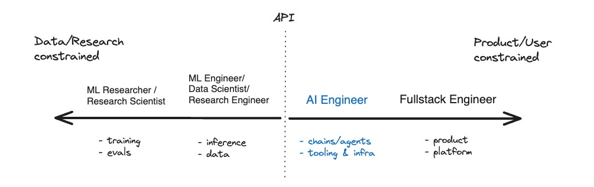
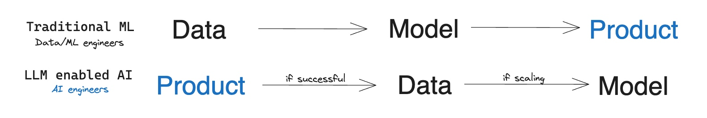
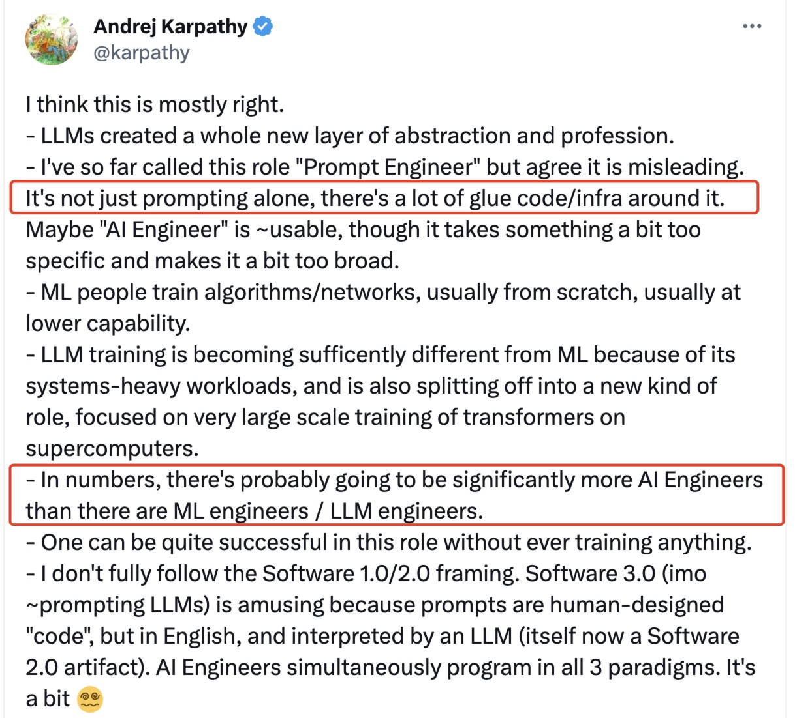

---  
share: "true"  
---  
# 大模型催生新的热门职业：AI Engineer  
> 这篇文章主要是对博主 @SWYX 的《The Rise of the AI Engineer》的阅读分享，当大家都在讨论 Prompt Engineer 的时候，博主深入思考后提出了 AI Engineer 的概念。AI Engineer 这一概念还受到了 OpenAI 核心成员 @Andrej Karpathy 的转发认可，认为其更能准确的表达大模型带来的新的软件开发子领域。  
  
## 什么是 AI Engineer？  
在回答这个问题之前，我们需要在一起看一下大模型的一些特点。结合文章我认为大模型有两个不容忽视的特点：  
  
- **泛化能力**：相比于之前 ML Engineer 针对特定业务场景训练出来的模型，大模型拥有更好的泛化能力，也就是说基于一个通用大模型，加上合适的提示、微调等，就能获得适配特定业务场景的模型能力。比如微软最开始放出 New Bing 的时候，大家就说其本质是 GPT-3 模型在搜索场景下的应用，而不是针对搜索场景重新训练的模型。另外比如 Jasper（AI 写作工具），也是大模型在写作场景下的泛化和应用。  
- **高门槛**：大模型对于算力、人才、数据都有很高的要求，而这些资源基本都被垄断在大厂内部。特别是算力资源，OpenAI CTO @Greg Brockman 曾说："We think the most benefits will go to whoever has the biggest computer"。回想移动互联网爆发的时候，无论是大厂还是创业公司，基本是在相差不大的起跑线上比试，各种新型的 Android/iOS App 层出不穷，真的有种百花齐放的感觉。但是在大模型训练上，创业公司的机会可能真的是比较少，相反使用大模型构建产品的机会更多一些。  
  
因此，以大模型服务提供的 API 为界，逐步划分为了大模型的生产者和使用者：  
  
  
*（图片源自《The Rise of the AI Engineer》）*  
  
API 左侧是 ML Researcher 和 ML Engineer，主要的工作是模型的训练和推理，最终的产出是大模型服务，并以 API 的方式提供出去。  
API 右侧是 AI Engineer 和 Fullstack Engineer，主要是使用大模型 API 的能力构建和改进产品。  
  
因此，可以简单地把 AI Engineer 概括为**熟悉并掌握大模型 API 能力，并将其应用到产品构建和改进中的软件开发工程师**。  
  
## AI Engineer 需要哪些关键能力呢？  
  
- **模型**：对大模型能力的熟悉和掌握。无论是对于 GPT-4 和Claude 这样的商业大模型，还是 LLaMA 这样的开源大模型，AI Engineer 都需要了解其有哪些能力、能力边界在哪里、能力的好坏等；  
- **工具**：对大模型相关底层工具的熟悉和掌握。从最流行的链式 (chaining)、检索 (retrieval) 和向量搜索 (vector search) 工具，如LangChain、LlamaIndex和Pinecone，到新兴的自主代理 (agent) 领域，如Auto-GPT和BabyAGI。  
- **认知**：原文是 News，我个人理解为对大模型的认知。大模型领域每天发表的论文、模型和技术的数量呈指数增长，为了更好的把大模型能力应用到产品中，AI Engineer 需要时刻关注并理解这些变化，不断更新自己的认知。  
  
### 和 Prompt Engineer 的差别？  
Prompt Engineer 主要关注的是调优 Prompt，以使大模型 API 返回的结果更加符合预期，这显然无法准确描述 AI Engineer 的工作，因为还需要结合很多基础工具完成代码开发。很简单的例子，仅仅有 Prompt 调优能力，是很难开发出 Auto-GPT 这样的项目的。  
  
### 和 ML Engineer 的差别？  
ML Engineer 有很大的精力是在训练特定领域的模型上，这个过程包括了繁杂的数据收集处理工作、模型训练、评估、推理工作；整个过程非常的复杂，迭代成本也比较高。  
而 AI Engineer 的工作流程则有点“相反”，他们为了验证产品上的想法，先把一些尝试性的 Prompt 提供给大模型，验证有效之后再收集更多的数据对大模型进行微调，以获得更适合自己业务场景的大模型能力。这一流程显然迭代成本更低、迭代效率更高。  
  
  
*（图片源自《The Rise of the AI Engineer》）*  
  
### Andrej Karpathy@OpenAI 的回应  
  
  
除了我们上面提到AI Engineer 和 Prompt Engineer、ML Engineer 的差异，Andrej Karpathy 也提到了，AI Engineer 的数量将会远远超过 ML Engineer 的数量。  
  
### 鄙视链？  
  
在部分程序员群体中会有一种莫名的“鄙视链”，就是越是做偏底层、偏内核工作的工程师，越是在技术上瞧不起偏应用、偏前端工作的工程师。做内核的工程师觉得自己转行做应用一定也行，而且相比只做应用的更有优势。  
  
你不能说这种想法完全错误，比如一个做 Android 操作系统开发的工程师，转行做 Android App 开发的话，结合自己对 Android 系统的深入理解，确实有可能写出更规范、性能更好的 App。  
  
大模型领域可能也会有类似的情况，AI Engineer 可能觉得自己没有那些从事大模型训练推理的工程师厉害。但一个有意思的现实是，大模型目前依然有很强的不可解释性，也就是训练大模型的人也无法充分了解和应用大模型的能力（我想 OpenAI 在最开始放出 ChatGPT 的时候，可能也没有充分了解这个产品的能力有多高）。而 AI Engineer 却可以在工作中通过不断的使用、尝试来加深对大模型能力的理解。训练大模型的工程师转而做使用大模型的 AI Engineer，还真不一定能够更好的发挥大模型的能力，想来也是有趣。  
  
## AI Engineer 的招聘要求是怎么样的？  
好奇看了一下网上 AI Engineer 的一些招聘需求，恰好有自己喜欢的 Notion 的招聘广告，一起看看他们的要求是怎么样的吧（直接翻译为中文了）：  
  
### 职责描述  
- **与团队合作利用 AI 特性进行原型构建和试验。**  
- **将新的 AI 技术集成到 Notion 的核心产品中并实现推广。**  
- 与跨职能团队合作按时交付产品功能。  
- **及时了解最新的 AI 技术和趋势。**  
  
### 技能要求（截选）  
- 您拥有使用 LLM、Embeddings或其他机器学习技术构建 AI 产品的经验。 您在以下一个或多个领域拥有 8 年以上的经验：机器学习、推荐或排名系统、自然语言理解/生成或人工智能。  
- 您了解系统的各个部分如何协同工作,从用户界面到数据模型。您熟悉关系数据库系统,如Postgres或MySQL,并有从零开始构建产品的经验。  
- 您精通数据生产链路相关技术：Spark、DBT等。  
- 您精通我们的任何技术栈：React、TypeScript、Node.js和Postgres。  
  
## 我们应该如何应对？  
  
记得大学本科临近毕业那会正是移动开发比较火的时候，自己技术能力属实一般，但是在朋友的帮助下还是找到了一个 Android 开发的实习。后来阴差阳错地继续读了研究生，但是研究生临近毕业的时候，依然凭借自己之前的 Android 开发经验，找到了不错的实习，并且最后也拿到了大厂的 Offer（后来在多个 Offer 中，阴差阳错选择了 Data Infra 行业，那是后话）。  
  
后来我回顾这段历史，发现自己当时真是“迷之自信”。当时拿到大厂 Offer 后特别开心，实验室的师兄弟也都恭喜我，当时觉得自己能力真是不错。现在回头看的话，自己不过是幸运地搭上了移动互联网的末班车而已。  
  
在其中一段实习经历中，有幸听一位清华毕业的技术大佬分享自己的工作经历，我至今依然有印象。他说当时毕业加入一家公司做输入法开发，老板让他可以选择平台：Symbian、Window Mobile、Android。他最终选择了 Android，但是他说自己当时真的是随便选的，因为刚毕业对这些平台也都不了解。当时公司最多的是做 Symbian 的，做 Android 的只有两个人（包括他自己）。可能当时他也不知道，这个选择在后面给他带来了多少机会。  
  
雷总说过，在风口上，猪也能飞起来。大模型显然是一个很大的风口，有的人兴奋，有的人焦虑。坦白讲，我没有想好如何应对，但是我知道这个技术会对我们产生很大的影响，因此我们一边要沉住气把自己的工作做好，一边也要对可能发生的变化保持关注，仅此而以。  
  
## 附录  
  
1. The Rise of the AI Engineer : https://www.latent.space/p/ai-engineer