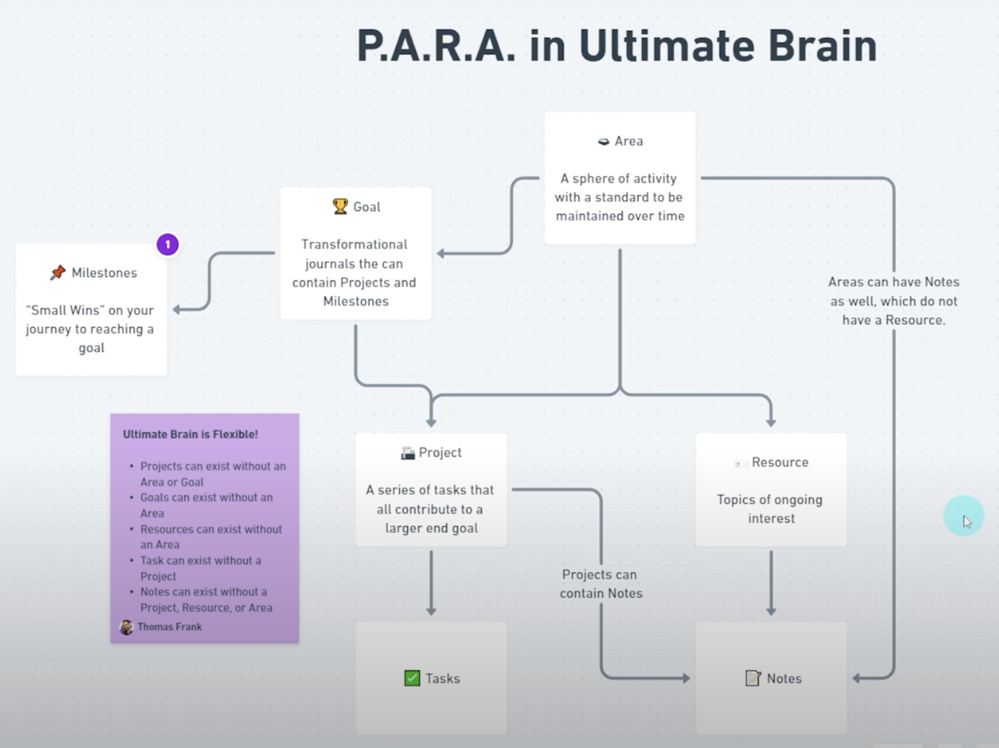

---  
share: "true"  
---  
我曾经特别喜欢印象笔记，特别是它的网页裁剪功能。只要看到喜欢的文章，我就点击浏览器的右上角，把它存下来。这种裁剪收藏的满足感，有点像囤积松果的小仓鼠。可能不会都消化了，但是囤积的过程很开心  
  
后来我慢慢囤积了几千条笔记，包含了一些自己手动输入的笔记。我为这些笔记分门别类，文件夹套文件夹。我也在印象笔记搞促销的时候买了年度会员，后来发现它是套娃式会员。买完没多久，它就新推出一个新会员，里面包含了你可能不会用，但是看到自己付费却不能用又很生气的功能  
  
后来我就把印象笔记抛弃了，它依然会安装到我的新手机和新电脑里，但是我几乎不会打开它。只有在我想要搜索某个“年代久远”的资料时，打开尝试一下。每次打开看着玲琅满目的笔记，也会感慨自己当时创建它们时是多么的如获至宝，奈何现在怎么都成了“牛夫人”  
  
我似乎很长时间没有意识到自己不会做笔记，就像一个声称要健身的懒人，看到一篇爆火的健身笔记，然后点击一下收藏，叶公好龙而已。但内心其实很明白，这篇笔记只是进收藏夹去吃灰了，你不会再见到它第二次  
  
我记笔记就是这样，一篇一篇的笔记，进入到我的笔记软件吃灰。这并不是记笔记的本来目的，当时在记录下它们的时候，肯定是想要做点什么，发挥点价值  
  
后来一次偶然的机会，我看到一篇英文文章，《The PARA Method: The Simple System for Organizing Your Digital Life in Seconds》，我才发现记笔记也是有方法的。不仅有方法，有的人还把它做成了一门学问，为它创建专门的网站和视频课程  
  
## PARA  
  
我觉得有必要给其他喜欢做笔记的朋友再安利一下 PARA 笔记方法，虽然我之前已经做过（[第二大脑｜如何打造All-in-One的信息和任务管理系统 - 理论篇](./%E7%AC%AC%E4%BA%8C%E5%A4%A7%E8%84%91%EF%BD%9C%E5%A6%82%E4%BD%95%E6%89%93%E9%80%A0All-in-One%E7%9A%84%E4%BF%A1%E6%81%AF%E5%92%8C%E4%BB%BB%E5%8A%A1%E7%AE%A1%E7%90%86%E7%B3%BB%E7%BB%9F%20-%20%E7%90%86%E8%AE%BA%E7%AF%87.md)]]）。如果要用一句话总结 PARA 的精髓的话，那就是：  
  
> 以**行动**为导向的笔记整理方法  
  
是的，不是以主题为导向，更不是漫无目的的塞满某个文件夹，而是以**行动**为导向。你裁剪的笔记、手写的笔记，应该是以做成某个事情为目的的  
  
> 这个要做成的行动，就是 PARA 中的 P (Project)  
  
还是以健身为例，把体重减少到某个范围，可以作为一个项目 Project。为了达成这个 Project，你可以搜集关于健身重要性、方法、成功案例的笔记，然后关联到这个 Project。这些笔记的目的，是为了让你更好的行动，来达成 Project 目标。  
  
如果一篇笔记能够直接作用于某个 Project，那就很大程度上解决了笔记吃灰的问题了，笔记真正的发挥了它应有的价值。这就是**行动**导向  
  
Project 是短期内的你要努力做成的事情，如果是长期要做成的事情呢  
  
> 对于长期要做成事情，可以归类到**领域**，也就是 PARA 中 A (Area)  
  
什么是长期要做成的事情呢？关于这个问题，《纳瓦尔宝典》对我的启发最大：  
  
> [幸福 = 健康 + 财富 + 良好人际关系](https://mp.weixin.qq.com/s/j-APAfu7qMRARoPMR8LHEg)  
  
对于一个要追求人生幸福的人来讲，他应该对于健康、财富、人际关系投入足够的关注，持续精进，“长期投资”  
李笑来在自己的书中也提到过类似观点，他说自己的主要生活内容就是：  
  
> 读书、健身、投资、帮朋友、陪家人  
  
所以你在设定自己的 Area 时，也可以参考一下，如何为自己的健康、财富、人际关系做长期的投资  
  
我觉得 PARA 中最重要的就是思考清楚 Project 和 Area，然后围绕着这两个方面进行笔记的整理。然后时刻提醒自己：**以行动为导向**  
  
PARA 中剩下的 R 代表 Resource，我理解为个人感兴趣的内容，比如摄影；短期内没有行动目的，但是想要一点点培养这方面的兴趣，积累这方面的知识；A 代表 Archive，就是归档内容，留作备忘查询  
  
当有一篇新笔记的时候，首先想一下它可以帮助到当前的哪个 Project，然后是 Area，再然后是 Resource。对于不再有价值的内容，及时 Archive，保持笔记的精炼  
  
提供一位博主整理的更加丰满的示意图做参考：  
  
  
*(by Thomas Frank)*  
  
PARA 方法主要是从笔记整理的角度，提供了系统性的建议。但 PARA 方法并不是唯一的选择，也无法解决某些问题  
  
比如对于写作，有时候感觉很难按照 Project 去整理笔记。写作很难定义为某个独立或者连续的 Project，一篇笔记也不会只应用与某个独立的 Project。如果定义为 Area 的话，当想要创作的时候，感觉又很难有效提取相关笔记  
  
直到后来我又遇到了《卡片笔记写作法：如何实现从阅读到写作》，我才发现原来笔记可以按照**网状**进行组织，并且随着笔记的积累，已经构建链接的笔记，可以为你的写作持续的提供灵感。而且卡片笔记法深入到了笔记内容的整理，即如何记笔记，才才能让未来的你翻看笔记的时候，**快速提取有效价值**  
  
写到这里发现篇幅有点长了，我发现大家已经不太喜欢读长文了，包括我自己。关于卡片笔记法，留作下篇继续……