---  
share: "true"  
---  
# 第二大脑｜如何打造All-in-One的信息和任务管理系统 - 实践篇  
上一篇是[理论篇](https://mp.weixin.qq.com/s?__biz=MzU1MTY5OTMyNw==&mid=2247483740&idx=1&sn=8ef09333c8fb0fae8a111da57ec52d07&chksm=fb8c174cccfb9e5af1be68ec5ca43ded939ebcfd1e14d23d5f2aecdab4a6c59c0af4a10565a1&token=138902046&lang=zh_CN#rd)，本篇介绍一下实践。我是基于Notion搭建的系统。  
  
## Why Notion  
  
网上有很多关于Notion的介绍，感兴趣的同学可以去了解一下，我就不过多介绍了。  
简单说一下我感受的一些亮点：  
  
- Markdown：很多编辑器都支持，这个是必备的。  
- Database：Notion有个Database概念，类似带主键的表格，这个是整理信息的利器。  
- 页面引用：页面之间可以互相引用。比LogSeq的Block引用功能弱一些，比印象笔记不支持引用强一些。  
- 美观：美观也是一种能力，看着舒服。  
  
在搭建All-in-One的信息和任务管理系统方面，**最关键的功能还是Notion Database的能力。** 该功能对于信息的整理和展示都很有帮助。  
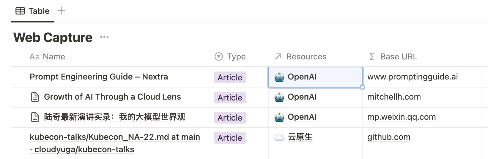  
给不了解Notion的同学简单介绍一下Database。你可以把它简单的理解为笔记中内嵌的电子表格。不过与电子表格不同之处在于：  
  
- 每一行都是一个独立的子页面，点进去可以继续书写内容；  
- 每一行都有一个「主键」，即子页面的标题；  
- 除「主键」外的其他列，都是子页面的属性；  
- 有多种展示方式，比如列表/看板/日历/画廊等；  
  
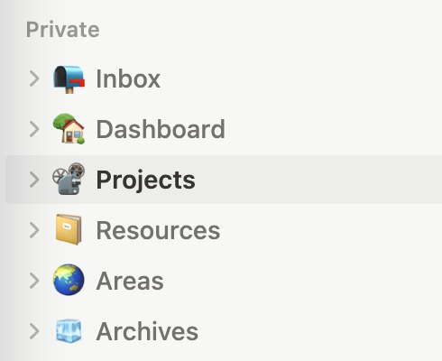  
如理论篇提到，我的Notion中有P(Projects)/A(Areas)/R(Resources)/A(Archives)几个页面。  
还有Inbox页面，作为信息和任务到达的“第一站”。  
  
## Inbox  
  
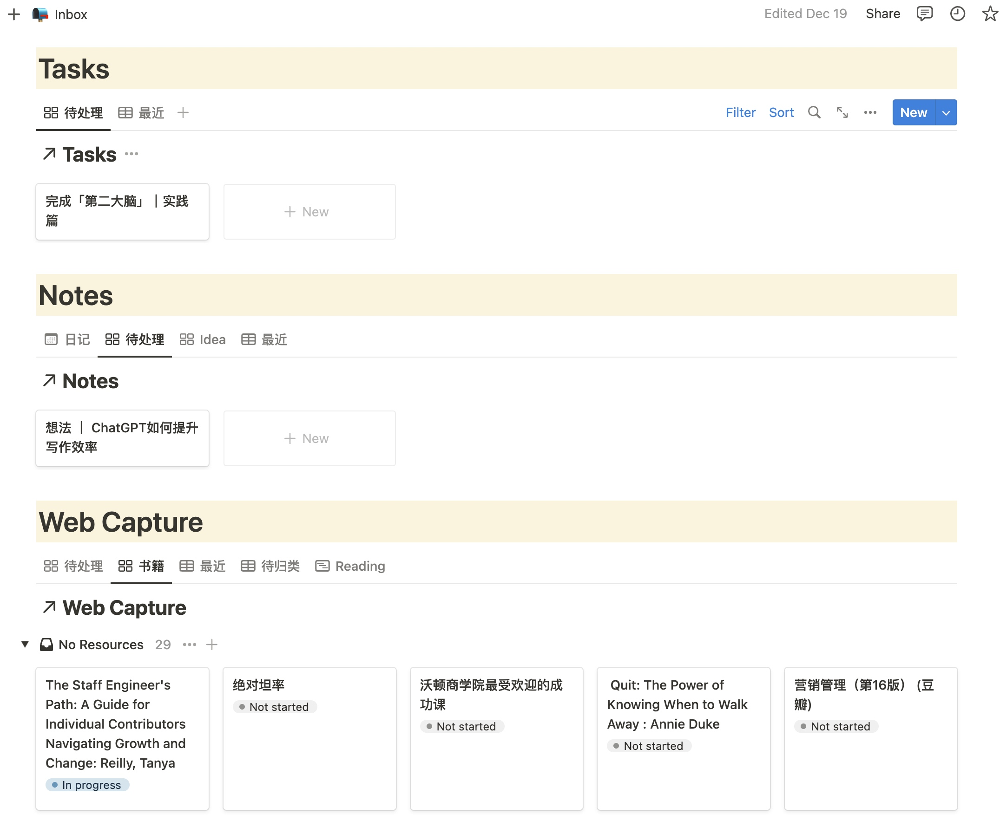  
Inbox页面我划分了3个区域，分别是Tasks/Notes/WebCapture：  
  
- Tasks：收录任务。**在任务产生的第一时间，先把任务记录下来。** 无论是被安排的任务，还是自己想到的任务。我不喜欢别人问我某个任务进展的时候，我突然发现自己完全忘记了。  
- Web Capture：主要是网络上各种资源的收录，我通过Chrome插件「Save to Notion」来裁剪网络资源，包括文章、视频等。它可以指定信息录入的Database，可以对喜欢的文字进行高亮。相比于印象笔记的裁剪插件，它默认不会录入全文，这个是我比较喜欢的。录入全文没有必要，徒增信息噪音。  
- Notes：区别于Web Capture中的信息来自互联网，Notes主要是个人“原创”的内容，包括灵光一现的想法、思考总结、日记、决策等等。  
  
信息录入后，需要定期整理：  
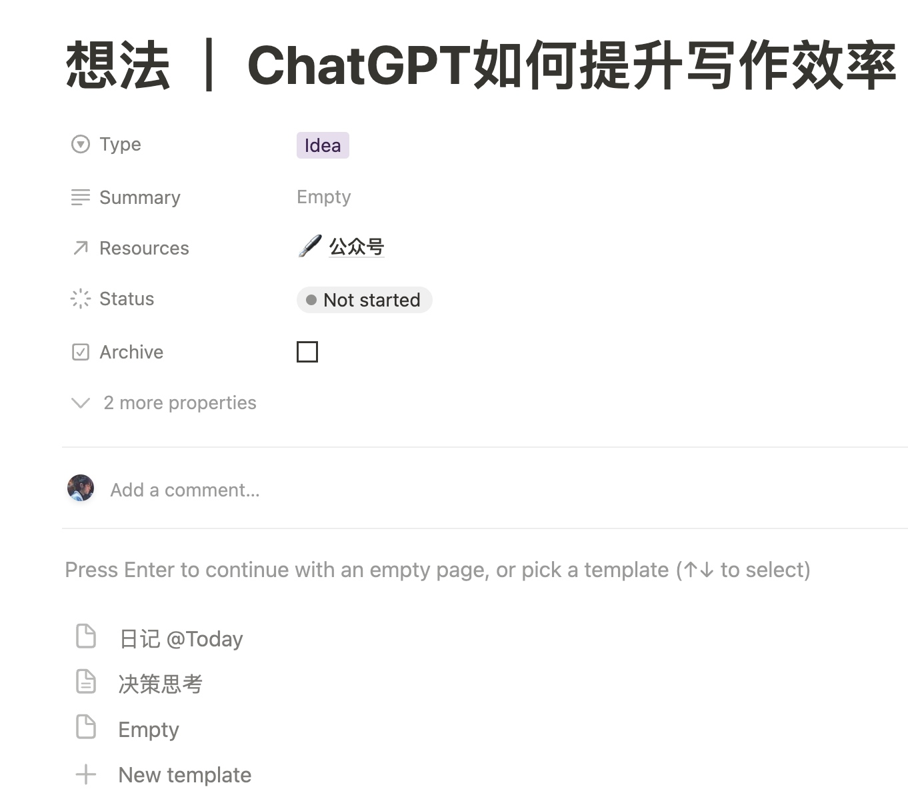  
  
- Task可以立即处理，也可以归入某个Project，后续跟进。  
- Web Capture可以阅读完后，记录亮点和总结，下次再阅读的时候可以快速“拾起来”。  
- Web Capture和Notes都可以关联到某个Resource，方便后续基于Resource定位需要的资料。  
  
## Areas  
  
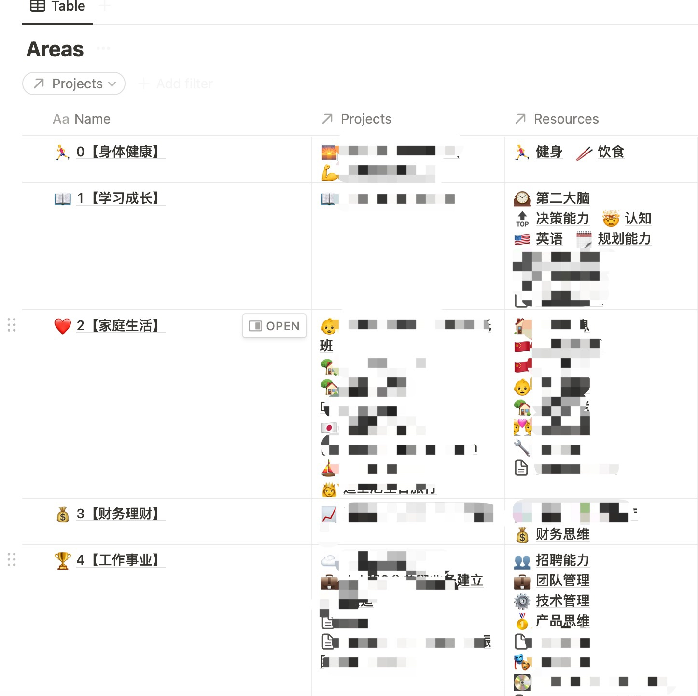  
  
关于Areas，再强调两个关键点：  
  
- **这个是「你」认为人生需要「持续」精进的领域；**  
- **它需要有「Projects」支撑行动，「Resources」支撑认知；**  
  
如上是我的Areas页面的一部分，一些私人相关的内容打码了。在梳理这个页面的时候，我有几点收获：  
  
- 均衡：我对人生重要事情的关注更加综合，而不是像之前那样“狭隘”。举个例子，之前我完全不关注「理财能力」，但其实你仔细想一下就会发现，单纯想要通过增加职场收入来满足人生的财务需求是不现实的，有资金流入而没有资金管理，迟早会出问题的。**「均衡」可以避免人生“偏科”**。我把这些Areas列在这里，并不代表我在这些方面的能力就提升了，但是 **「关注到」是提升的前提**。  
- 掌控感：互联网里好像有个术语叫“全景图”之类的，通过梳理这些方方面面，我感觉心理踏实了很多，像是有了人生规划的“全景图”，对于人生的掌控感有提升。心里越踏实，越容易投入到当前的工作，也越容易幸福。要不然总有隐忧自己是不是错过了什么、遗忘了什么。  
  
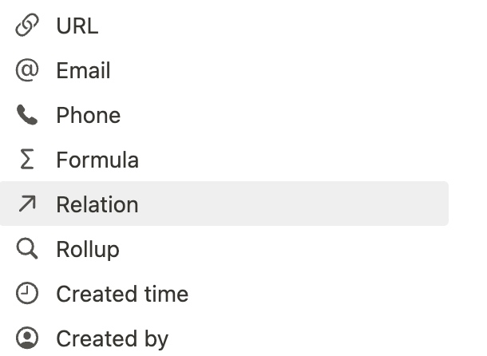  
  
这里用到了一个Notion的关键功能，Relation。介绍一下：  
  
- 它是Database的数据属性之一；  
- 你可以把它简单类比为数据库中的外键，通过它可以连接到其他Database的“主键”；  
- 我通过它把Areas和Projects/Resources关联起来；  
  
## Resources  
  
Resources页面记录了Web Capture（互联网资料）和Notes（个人笔记），主要分享一下Web Capture的个人用法。  
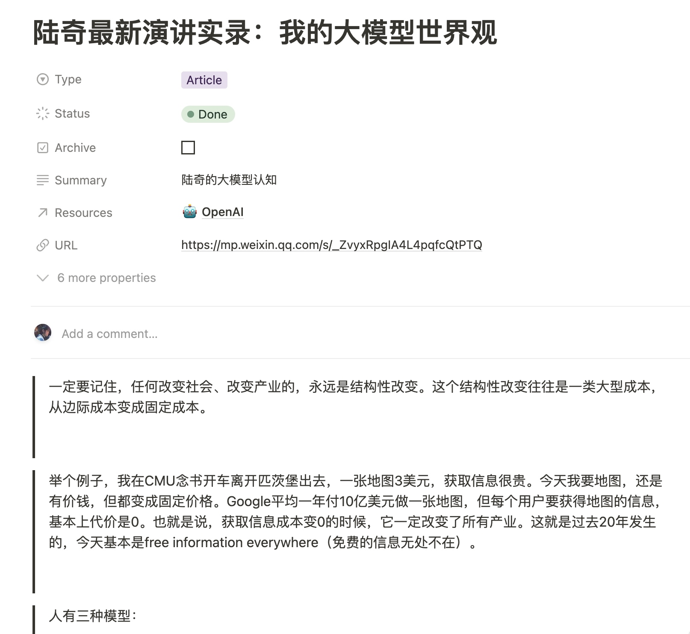  
  
在上面Inbox章节提到，遇到不错的网络文章，我先是通过「Save To Notion」收录到Inbox中。收录之后就可以利用空闲时间进行阅读消化了，比如午饭/晚饭后、下班前（**建议不要早上处理，因为早上的充沛精力太珍贵了，拿来读碎片文章太浪费。强烈建议早上上班前的时间用来处理「难而重要」的事情**）。  
  
如上是最近阅读的陆奇的分享，有几个实践心得：  
  
- 把Web Capture进行分类，方便检索。我分类为Article/Audio/Video/Book/Slide/Paper。比如我想要寻找之前标记的某本想读的书籍时，可以通过筛选Book快速找出来。  
- 通过Status对阅读进度进行标记。In Progress是当前正在读的，比如食堂排队的时候可以快速找出In Progress文章继续阅读。Done是阅读完的，标记之后不再显示在常用页面中。**保持页面的简洁是提升效率的重要方法，信息太多就过载了**（和保持办公桌面简洁的效果类似，最起码有个好心情）。  
- 标记为Archive可以认为暂时不需要了，文章会“移动”到「Archive」页面，只用来搜索用。  
- 通过「Resources」Relation就可以实现前面提到的关联。这一步非常重要，便于后续基于「Resources」进行文章的回看。比如想要加深对于大模型的认知，我可以基于「OpenAI」这个Resource对所有Web Capture盘点一下，然后个人的思考认知可以输出到「Notes」中（或者到公众号里面，输出倒逼输入）。  
  
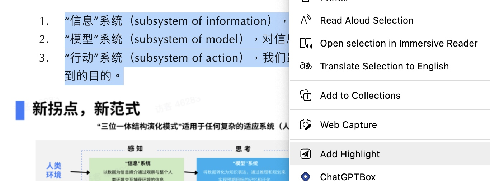  
  
仔细看你会发现上图中只收录了了陆奇文章的一些片段，这个就是之前提到的，避免全文记录，只记录重点。这个功能是「Save to Notion」提供的，在“剪辑”文章后，可以通过上图的「Add Highlight」把关键片段收录下来。除了截取关键片段，也可以加入一些自己的总结（或者ChatGPT的总结），方面下次回看的时候快速抓住关键信息。  
  
## Projects  
  
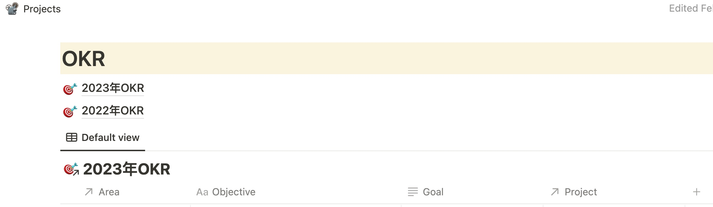  
  
Projects是为了通过「行动」来推动「Areas」精进的（上一篇着重提到，PARA是行动导向的）。这个页面的第一部分信息是我的「个人年度OKR」，这个和「工作OKR」共同组成了我的年度规划。OKR是个很不错的工具，推荐大家了解下。有了个人年度OKR，然后才有Projects的拆解。  
  
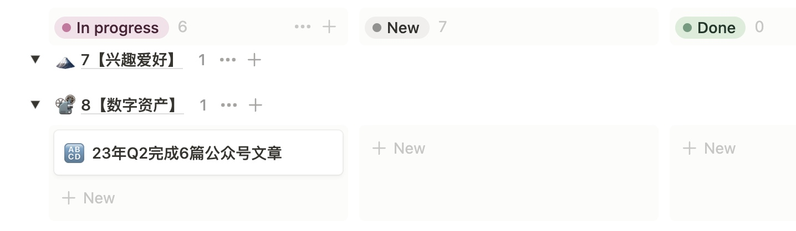  
Projects也是通过Database组织的，并且按照Areas和Status进行分组。如上图是一个Q2公众号写作的Project，这个是基于自己写作的年度OKR拆解下来的（其他Projects偏私人化就没截图）。  
  
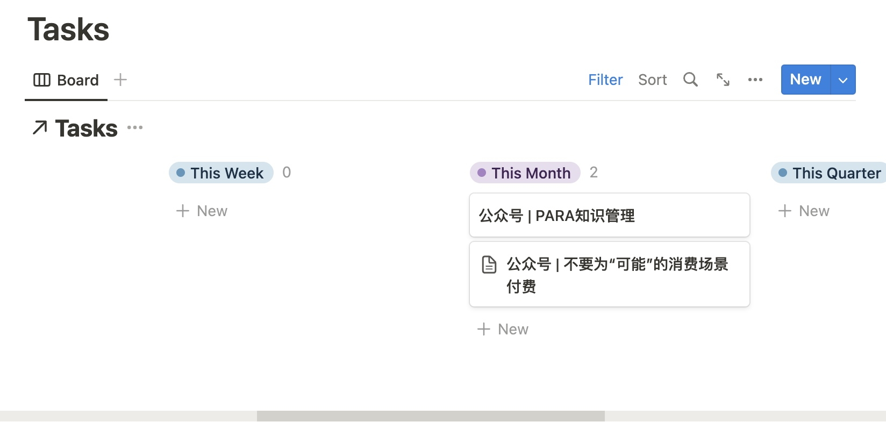  
  
在Project页面中主要内容就是Task的拆解，比如这个是一些可以写的文章。Notion支持模板工具，可以实现每新建一个Project页面，自动生成Tasks看板。我一般按照时间和状态对Task的进行分组跟踪，这样可以快速抓住应该关注的Task。  
当然还有一些其他内容，比如如何完成Project的想法、完成后的复盘反思等。  
  
## Archive  
这个确实没有什么好写的，前面截图有展示，包括Areas/Projects/Resources等页面在内，都有一个「Archive」的复选框。选中之后那些页面就“移动”到Archive这个页面了。  
目的是为了保持「聚焦」，减少不重要信息的干扰。为什么不直接删除呢？因为还是有可能会用到这些信息的，这个时候能够搜索出来就够了。  
  
## 个人思考  
  
-  做这么复杂有必要吗？这个系统搭建下来对我还是有一定帮助的，让很多事情更加条理了，生活的掌控感有提升。**但是说实话工具不可能本质性的改变什么，工具只是辅助作用，不要有过高的预期**。不过后退一步说，即使这套系统实质作用不大，我依然“乐在其中”。因为我发现自己是个喜欢整理信息的人。就像我老婆工作累的时候，喜欢收拾家里，收拾完之后她就很开心。我在工作累的时候，喜欢“收拾”信息，把我的信息和任务管理系统“收拾”一遍，我就感觉非常畅快。  
-  警惕成为“知识仓鼠”。这个是我最近新学到的词，就是收集了一大堆资料/知识，但是根本没时间看（或者懒得看）。我觉得要用好上面的系统，**Projects依靠严格的自律执行，Resources需要经常复盘思考，常看常新**。否则就是花架子了。  
-  Notion的使用不足：基于Notion搭建这套系统，也有不便之处，特别是对“生活任务”的管理能力偏弱。所谓的生活任务可能是某个时间点去做某事，比如下周末带孩子去某个地方玩。这种任务我可能会用其他工具记录并提醒。Notion更适合“大项目”的拆解和记录。  
-  如何更好的执行？上面提到了需要「自律」，这个是必备的。同时需要有「整段的时间」。**无论是推进Projects，还是高信息密度的Resource的学习，都需要整段的时间投入**。我分析后发现，通过早起，利用上班前的时间是最可行的。首先上班时间是没时间做个人事情的（如果你想在公司好好干下去的话）；下班后太累了，还要陪孩子；周末也需要陪孩子（如果现在你还没有孩子，请珍惜你的“自由”）。所以就剩下早晨上班前的时间完全属于自己了。此时孩子还没醒，不要你陪；同事还没上班，不会找你；而且早上精力还比较旺盛（特别是喝一杯咖啡后）。**总结一句话，得早起……**