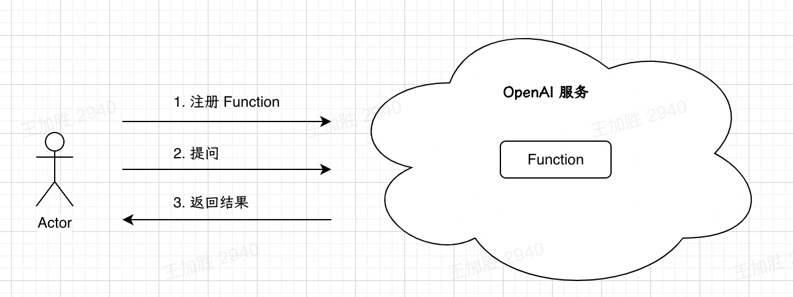
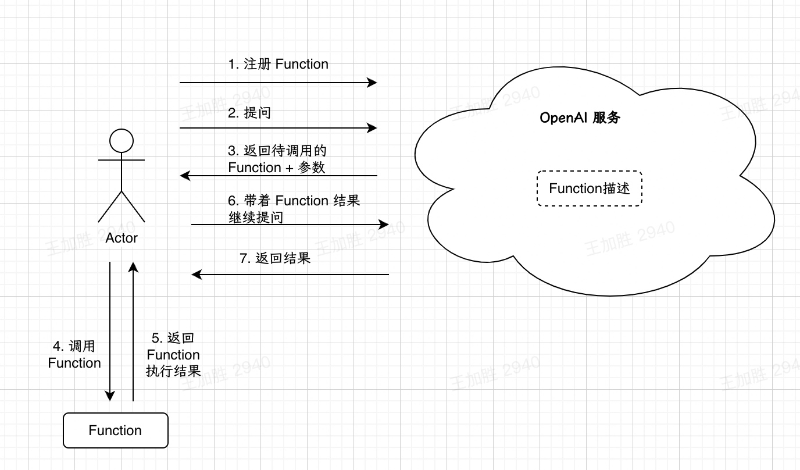

---  
share: "true"  
---  
# 闲扯GPT｜尝试理解 GPT API 的Function Calling  
  
  
  
最近 OpenAI 对GPT API 的能力进行了升级，其中一项重要升级是增加了**Function Calling**能力。它的官方描述是这样的：  
  
> Developers can now describe functions to gpt-4-0613 and gpt-3.5-turbo-0613, and have the model intelligently choose to output a JSON object containing arguments to call those functions. This is a new way to more reliably connect GPT's capabilities with external tools and APIs.  
  
简单说就是用户可以在 GPT API 中注册 Function 并实现调用。  
  
我的第一直觉是如下图，用户可以把自己的 Function 注册到 OpenAI，然后在和 GPT 对话的时候，根据对话内容可以触发对 Function 的调用，就像 Plugin 那样。  
  
  
  
  
但仔细看下来发现自己理解错了，GPT 其实并不管 Function 的执行，Function 的执行是由用户（或者说开发者）自己调用执行的，GPT 只是根据用户的 Prompt，**确定需要调用的函数以及函数的参数输入**，然后返回给用户。  
  
  
  
上图只是一个示例，真实情况是 OpenAI 也不会“持久化” Function 描述，而是需要用户每次在发送的 Prompt 中携带 Function 描述  
  
### Function是怎么描述的  
以官方文档中的示例为例，假如我们有一个查询某个地方的天气的Python Function：  
```python  
def get_current_weather(location, unit="fahrenheit"):  
    """Get the current weather in a given location"""  
    weather_info = {  
        "location": location,  
        "temperature": "72",  
        "unit": unit,  
        "forecast": ["sunny", "windy"],  
    }  
    return json.dumps(weather_info)  
```  
注意，这个代码是“伪造”了一个天气信息，真实的 Function 可能是调用第三方的天气 API 来查询天气。  
  
那么该 Python Function 对应的描述是：  
```JSON  
{  
    "name": "get_current_weather",  
    "description": "Get the current weather in a given location",  
    "parameters": {  
        "type": "object",  
        "properties": {  
            "location": {  
                "type": "string",  
                "description": "The city and state, e.g. San Francisco, CA",  
            },  
            "unit": {"type": "string", "enum": ["celsius", "fahrenheit"]},  
        },  
        "required": ["location"],  
    },  
}  
```  
  
可以看出其中有几个关键信息：  
  
- name:  Function名称；  
- description: Function 的功能描述；   
- parameters: Function 的输入参数，包括参数的名称、类型、描述等；  
  
在和 GPT 对话时，携带该描述，GPT 就可以根据对话信息，判断是否需要调用这个 Function，并根据 Function 的“签名”给用户返回需要传给 Function 的输入参数。  
  
如果你是一个程序员的话，应该发现了，这不就是把程序中的注释给 OpenAI 描述了一遍吗  
所以说啊，**写代码的时候把注释写好的能力愈加重要了**😂  
  
不过我没有发现对于 Function 返回值的描述，是默认只能返回 String（字符串）了吗？懂的同学帮忙留个言。  
  
## 「自然语言」与「编程语言」之间的“翻译器”  
  
大概搞清楚 Function Calling 的功能后，我觉得与其叫**Calling**，不如叫**Translating**。GPT 实现了**自然语言**和**编程语言**之间的翻译功能，我觉得这个能力非常了不起！  
  
我们慢慢解释一下到底怎么个“翻译”：  
  
### GPT的伟大意义  
  
之前看B站Up主“课代表立正”对GPT的划时代意义有一个描述，我印象深刻：  
  
> **ChatGPT已经接近人类调用算力和数据的最终极形态了！**  
  
当时这句话对我来讲非常震撼，GPT 实现了对数据/知识的高效压缩，而人类只需要使用自己熟知的自然语言，就可以调用这些数据/知识，这极大地降低了使用门槛。  
  
但当时我没有完全听明白**调用算力**是什么含义。GPT 确实可以做一些“计算”，包括文本总结、问题回答等，但似乎 GPT 能够调用的计算能力有限。  
  
对算力的调用，人类目前还是主要依赖各种编程语言，这个“语言”有一定的使用门槛，主要是程序员在使用。哪怕是易用性非常友好的SQL，也有不小的学习门槛。  
  
但是 Function Calling 这个能力，我觉得是对上面的话的进一步“佐证”。这个能力并不是革新了 Function 的执行方式，而是革新了 Function 的调用方式。普通用户可以不依赖编程语言而实现 Function 的调用，也就是算力的调用。  
  
### GPT的“局限性”  
上面是从算力调用的角度去讲的，如果从 GPT 的“局限性”去讲，也能发现 Function Calling的意义。  
  
所谓的 GPT 的“局限性”，其实是指**自然语言的局限性**。诚然自然语言的使用门槛比较低，但是自然语言也有**表述模糊的局限性**。  
  
大家使用 GPT 多了就会发现，有时候想要得到自己想要的准确结果，描述起来是很费力的。特别是想要限定输出格式、类型、字数等等的时候，哪怕多试几次都不一定搞得定。  
  
但是这恰恰是**编程语言**的强项，编程语言在“描述”输入、处理方式、返回结果等方面，那都是有“精准”的表述方式的。  
  
以大数据领域常用的 WordCount Demo 为例，如果用 Python 实现的话，几行代码就可以搞定：  
  
```python  
def word_count(text):  
    words = text.lower().split()  
    word_counts = {}  
      
    for word in words:  
        if word in word_counts:  
            word_counts[word] += 1  
        else:  
            word_counts[word] = 1  
      
    return word_counts  
```  
  
但是如果要求你用 GPT 实现上述处理的话，你可以想一下大概需要怎么表述才可以，并不简单。  
  
有了 Function Calling 的能力，就可以把**自然语言的易用性** 和 **编程语言的准确性** 结合起来，更好的调用算力。  
  
### “翻译”  
  
搞清楚上面的意义后，你会发现 GPT 确实有点像个“翻译”，它可以把“用户的语言”翻译成“程序的语言”，它翻译后的“程序语言”就是 Function的名称和输入参数，这个是程序可以“理解”的。  
  
此时此刻，我忍不住想到了一部可以“申遗”的电影的名场面……下面是（不正经的）翻译示例：  
  
1. 有一天晚上，一个 GPT 用户对于什么是“惊喜”产生了巨大的疑问，于是他问 GPT：  
       
2. 我们的 GPT 也有点懵，不太知道怎么回答（惹得用户都开始骂娘了）。但没关系，他可以调用一下第三方的 Function 来回答（实际上应该由用户自己调用，但你懂得……）  
      
3. 第三方 Function 接受输入参数“惊喜”，然后处理之后给出了输出：  
      
4. 最后，要注意 Function 的返回结果并不是直接给到用户的（用户可能听不懂），而是由 GPT 根据上下文总结整理后，转述给用户的：  
      
  
翻译功能演示完毕，完美😂  
