---  
share: "true"  
---  
# 闲扯｜ChatGPT｜《奇绩创坛》北京场观众最关心的十个问题  
## 缘起  
  
上个月的《奇绩创坛》北京场非常火爆，现场人很多，最后的问答环节大家也很积极，提了很多问题。  
创坛的问答环节设计得比较巧妙：  
  
- 提出问题：大屏幕上有个二维码，现场观众可以扫码提出新问题，也可以给其他人提出的问题点赞+1。  
- 选择问题：大屏幕上会实时滚动展示新问题和热门问题，工作人员从中选出点赞比较高的问题，由陆博士回答。  
  
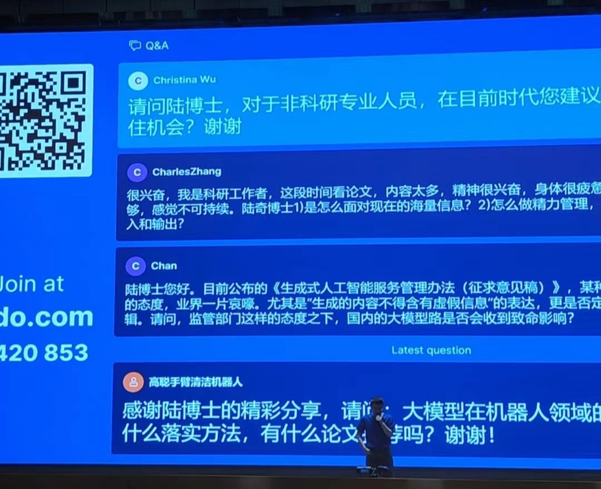  
  
这个方式确实不错，参加过技术分享的人都知道，问答环节如果根据举手随机选择的话，效果可能不好。  
一是问题质量可能不高，表述不清或问题小众；  
二是流程可能不好把控，造成时间的浪费。  
而这种扫码提问并选择高赞问题的方式，一定程度上解决了这个问题。  
  
不过这种方式也不完美，点赞高的问题并不代表质量高，有一些问题比较“搞怪”吸引眼球。另外就是被选中的问题不一定真的具有代表性，不一定是多数人关心的共性问题。  
  
当时有个脑洞，**这个事情是不是可以用 GPT 来解决，分析所有人提出的问题，找出大家关心的共性问题并进行总结提炼。**  
  
## 获取数据  
  
现场提出的问题依然在网站上保存着，可以拿来分析（见附录）。之前没有搞过爬虫，我直接把问题所在的网页下载下来，然后从网上搜了一个`BeautifulSoup`的示例代码，简单修改后进行问题提取。  
```python  
soup = BeautifulSoup(contents, 'html.parser')  
  
# find all the target sentences  
sentences = soup.find_all('span', text = re.compile(".{10,}"), class_ = False)  
```  
问题输出为 txt 文件，每行一个问题，共 683 个问题，35000 多字。  
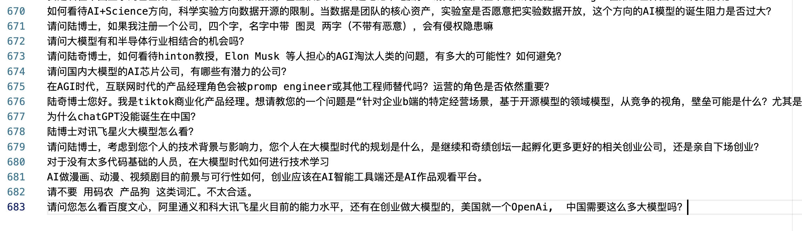  
问题有点多，需要简单“清洗”下。我把小于 50 个字的问题过滤掉了（字数太少的话问题可能比较宽泛），并且把一些对总结没有帮助的礼貌性用语全部删除了（比如“请问”、“谢谢”、“陆博士”等等）  
  
清洗后还是有两万多字，严重超出了 Token 限制，直接用 ChatGPT 一次性对话总结是不可能了，得想其他办法。  
  
## 思路一：使用 ChatGPT 分段分析  
既然一次对话搞不定，换一种思路就是把问题分批次发给 ChatGPT 进行处理。  
首先交代任务，大致意思就是告诉 GPT 我会分批次发送问题给它，等我发送完成之后，它需要对问题进行总结提炼。  
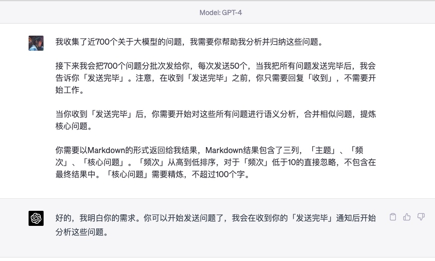  
然后发送第一批问题给 GPT，并且通过反引号把问题括起来：  
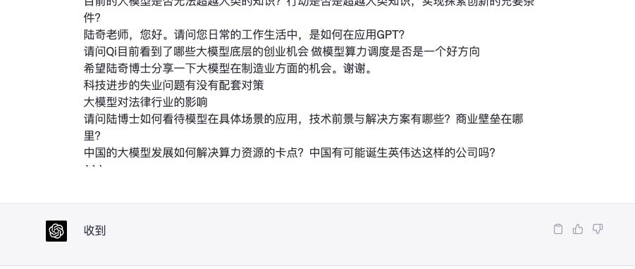  
不错不错，看起来有效果。  
但是不要高兴太早，在发送第二批问题的时候，就发现 GPT 丢失了“上下文信息”，忘记最开始的要求了：  
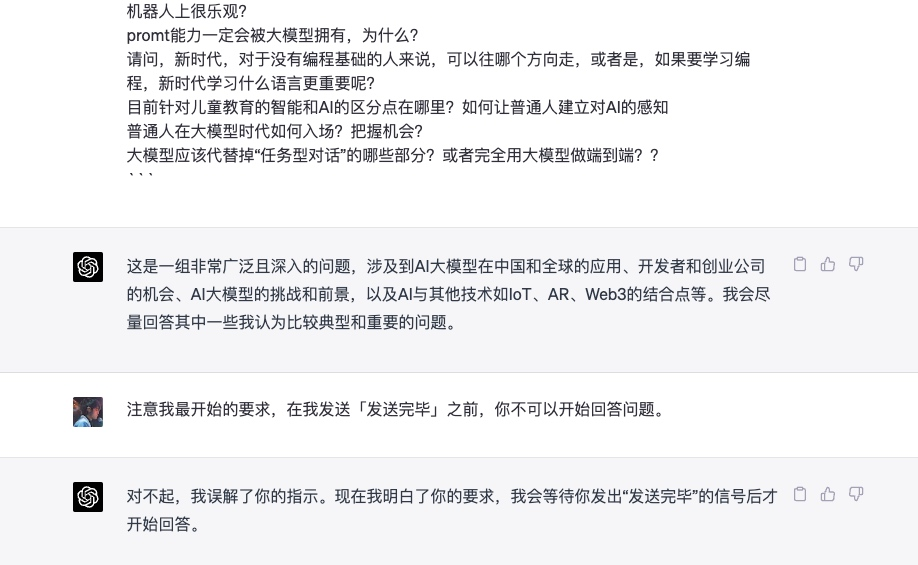  
在发送更多问题批次时，GPT 会直接开始分析，这个并不是我想要的。  
我搜了网上很多资料，没有找到好的解决办法，遂放弃这个思路。  
  
## 思路二：使用 Claude 100k  
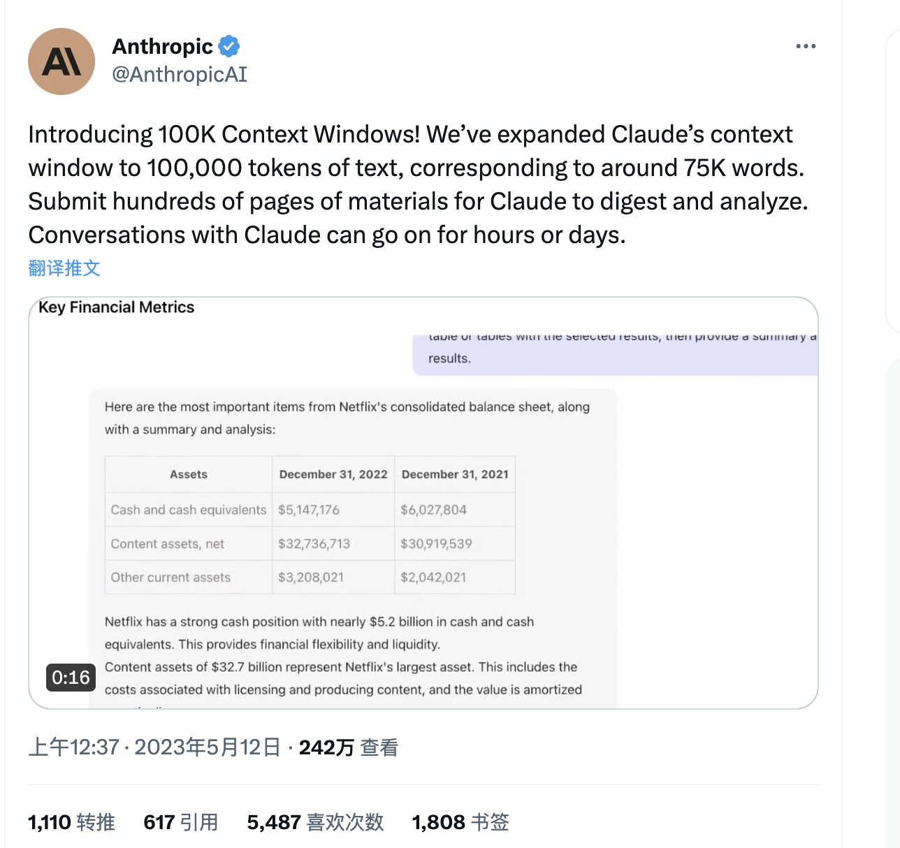  
  
突然有一天看到消息，Anthropic 放出了Claude 100K，不可思议。100K 的 Token 数量，完全能够一次性分析所有收集的问题。  
但是我并没有搞定如何使用 Claude 100K……  
  
  
一种方式是上官网进行 Request Access，我申了几遍之后没有任何回应，不知原因；  
第二种方法是在 Slack 中试用，但是 Slack 客户端本身就不支持发送过长的文本，更不要说试用 Claude 100K；  
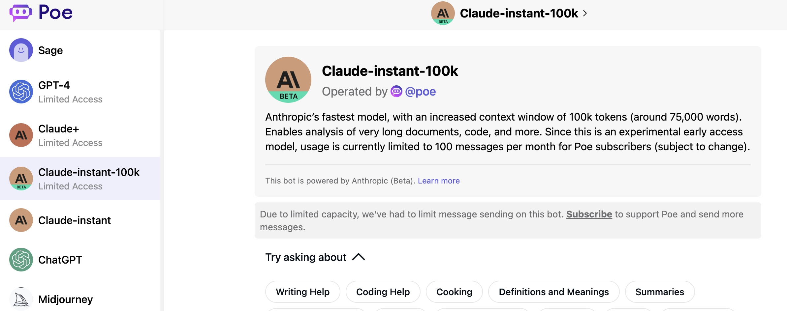  
第三种是在`poe.com`上进行订阅，然后使用 Claude-instant-100k （只能在网页端）。但是这个需要绑定信用卡，我对于外网绑定信用卡还是心里没底，另外也不舍得花这个钱折腾（何况这个还没有 API 接入能力）……  
  
## 思路三：GPT API + “截断/抽帧”总结  
网上有一些比较热门的插件，可以用来总结 Youtube 视频。原理比较简单，就是把 Youtube 视频的字幕下载下来，然后发给 GPT 进行总结。  
如果你简单看一下他们的代码的话，会发现略微有点“简单粗暴”。大致两个思路：“截断”和“抽帧”  
  
### 截断  
  
方法就是把超出限制的文本直接丢弃……  
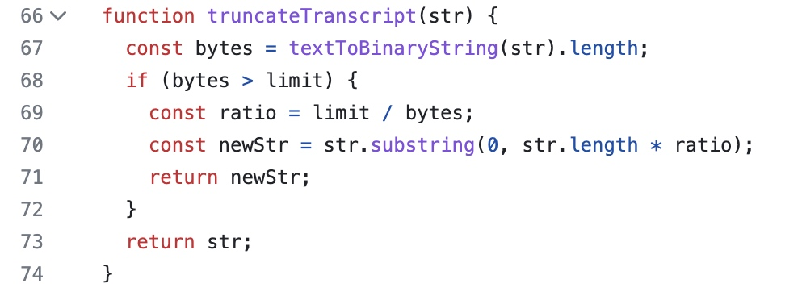  
  
### 抽帧  
  
把整个文本切分为Chunk，如果 Token 超了，就取 Index 为偶数的 Chunk（还能这样……）。  
递归该方法，直到满足 Token 限制。  
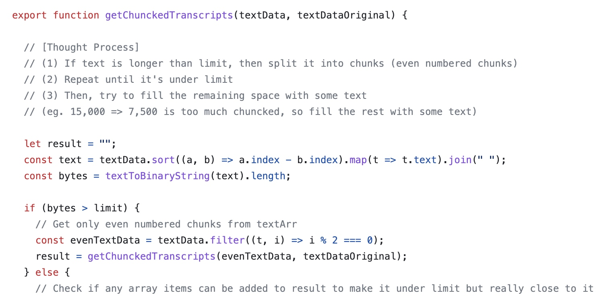  
  
这两个方法都会造成原始信息的丢失，可能对于一些信息密度不高的文本有一定效果，但是我要总结的是不同观众提出的问题，你丢掉一些观众的问题再总结，就有点说不过去了。  
  
## 思路四：GPT API + “MapReduce”总结  
搞过大数据的同学都对 MapReduce 比较熟悉，是的，就是那个思路。  
这是在一个 Github 项目中偶然发现的：**BriefGPT**（见附录）。它支持通过 GPT 分析整个文本文件，可以进行**对话**和**总结**：  
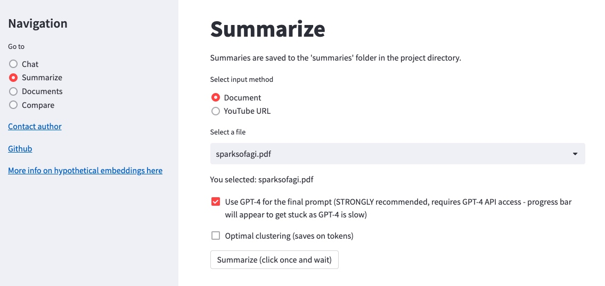  
  
我主要对其中的总结功能比较感兴趣，大概看了一下原理。  
它的总结功能主要用到了**LangChain + Embedding + K-Means**，大概流程如下：  
  
**文本切分**  
使用 LangChain 中的`TokenTextSplitter`对整个文本进行了切分：  
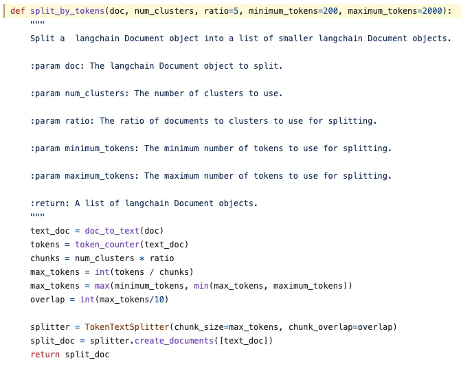  
  
2. **Embedding**  
使用`OpenAIEmbeddings`把切分后的文本转为向量，这一步的目的是为了后续的 K-Means 聚类：  
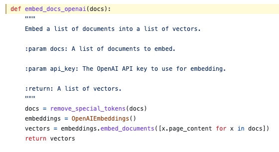  
  
3. **K-Means 聚类分组**  
通过`KMeans`把上一步得到的向量组进行聚类分组，**相当于把整个文本中内容相近的分片放在一起**：  
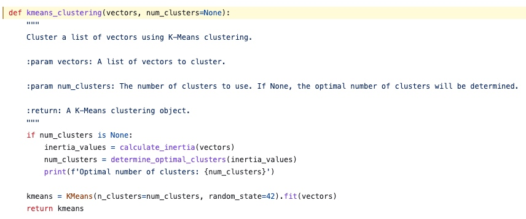  
  
4. **提取每组的核心分片**  
上一步完成分组后，作者在这一步提取了每个分组中距离中心点最近的文本分片。  
我不确定自己的理解是否准确，但是这样看起也是“丢弃了”不少信息：  
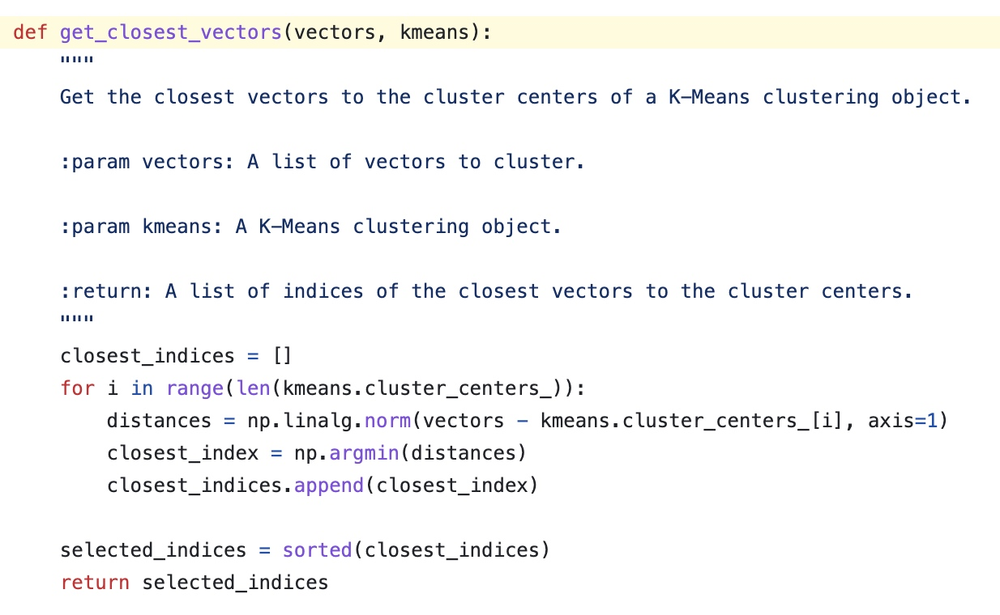  
5. **"Map"阶段**  
调用 ChatGPT，对上面提取的各个分组的核心分片进行总结。  
直接贴一下作者的Prompt：  
> You will be given a single section from a text. This will be enclosed in triple backticks.  
> Please provide a cohesive summary of the following section excerpt, focusing on the key points and main ideas, while maintaining clarity and conciseness.  
>  
> '''{text}'''  
>  
> FULL SUMMARY:  
  
6. **“Redude”阶段**  
调用ChatGPT，对上面的所有总结内容进行进一步的总结。  
直接贴一下作者的Prompt，这部分写得更加复杂，可以学习一下：  
  
> Read all the provided summaries from a larger document. They will be enclosed in triple backticks.   
> Determine what the overall document is about and summarize it with this information in mind.  
> Synthesize the info into a well-formatted easy-to-read synopsis, structured like an essay that summarizes them cohesively.   
> Do not simply reword the provided text. Do not copy the structure from the provided text.  
> Avoid repetition. Connect all the ideas together.  
> Preceding the synopsis, write a short, bullet form list of key takeaways.  
> Format in HTML. Text should be divided into paragraphs. Paragraphs should be indented.   
>  
> '''{text}'''  
  
## 方案改进  
这个是使用 BriefGPT 对问题总结的结果：  
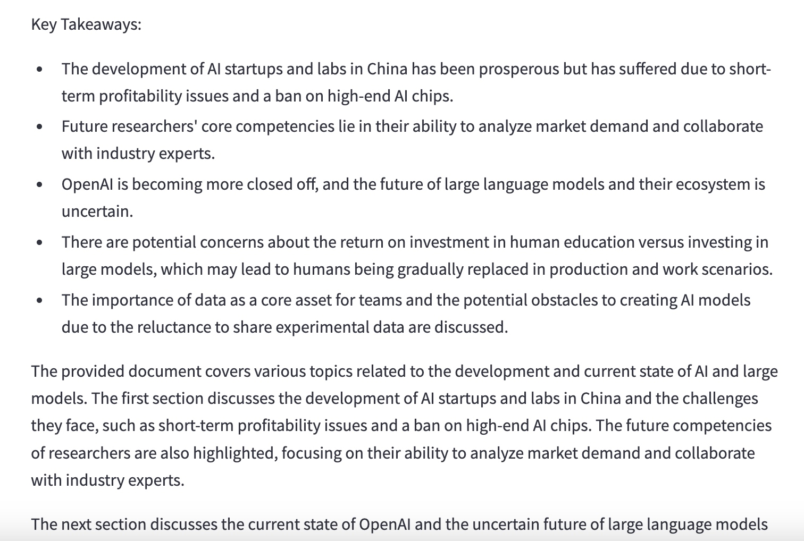  
  
确实能够完成总结，不过针对我的需求还有一些可以改进的点：  
  
### 语言  
默认的 Prompt 总结出来是英文的，需要修改为返回中文。  
  
### 语气  
默认的总结结果是“第三方”的语气，总结内容已经不是“问题”了，而是叙述。  
需要修改为提问者的语气，总结内容也要是一个一个的“问题”。  
  
### Token Split  
默认的 Token Split 使用的是`TokenTextSplitter`，按照 Token 大小来切分。这个不太满足需求，因为有可能把一个用户的问题切分到两个分片里面。  
修改为使用`CharacterTextSplitter`，按照换行符进行分片，一个用户问题对应一个分片。  
  
### 提取分片  
默认的是在每个分组中提取一个核心分片，这就意味着每个分组会提取一个用户问题。这个不太满足需求，因为会丢掉很多问题。  
修改为把一个分组里的所有问题按照换行符拼接起来，把拼接内容发送给 GPT 进行总结（注意控制拼接的长度，超过一定长度后先发送，然后继续拼接继续发送）。  
  
### Prompt  
根据问题分析总结的场景，重写 Prompt  
  
**"Map" Prompt:**  
  
> **Your task is to generate a short summary of questions from a technical conference to help the speaker understand what the audience care about.**  
>  
> Summarize the questions below, delimited by triple backticks.  
> Format your response in bullet points and limit at most 3 points.  
> Make your response in the tone of the audience and language in Chinese.  
>  
> Questions:  
> \```  
> {text}  
> \```  
  
**"Reduce" Prompt:**   
和上面基本一样，只不过把返回 3 个问题修改为返回 10 个问题。  
  
## 效果展示  
  
### 分组能力  
上面方案中有一个很重要的步骤，就是**基于 Embedding Vector 对相似问题进行分组**，然后提交给 ChatGPT 进行总结。  
我还是很好奇分组效果怎么样的，于是把一些中间步骤的提问和回答打印出来看了一下。  
  
如下图是其中一个“Map Task”的截图：  
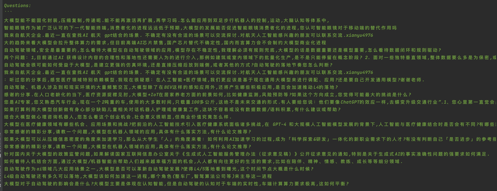  
  
如果仔细看可以发现，这个分组有很多关于**自动驾驶**相关的提问。问题抽样：  
  
> - 自动驾驶作为ai领域几大应用场景之一,大模型是否可以革新自动驾驶发展?使得L4/5落地看到曙光,这个时间节点大概是什么时候?  
> - L4级自动驾驶还有多久可以落地,大模型该如何加速这一进程,哪个角色(整车厂,智驾算法公司等)来主导这一进程  
> - 大模型对于自动驾驶的影响会是什么?大模型主要是体现在认知智能,但是自动驾驶的认知对于车端的实时性,车端计算算力要求极高,这如何平衡?  
  
可以看出来分组还是有一定效果的，自动驾驶相关的问题放在了一个分组里。  
  
该“Map Task”对应的总结输出如下，确实也包含了自动驾驶的内容：  
  
> - 大模型能否固化封装、压缩复制、传递，再激活扩展和学习，如何应用到双足步行机器人的控制、运动和大脑认知等体系中？  
> - 大模型的发展能否促进智能眼镜消费者化的进程？您认可智能眼镜对于移动端的替代作用吗？  
> - 在**自动驾驶领域**，大模型存在不稳定性，必须有规则兜底，数据重要还是模型重要？怎么看待数据闭环和规则驱动？  
  
不过从上面的抽样问题看，不少观众比较关心**大模型能否加速 L4 级自动驾驶的落地**。总结输出中虽然提到了自动驾驶，但是并没有总结出这层意思。  
不知道是我的 Prompt 写得不好，还是 GPT-3.5 的总结能力差点意思……  
  
### **观众最关心的十个问题**  
终于得到最终结果了！如下是程序返回：  
  
1. **未来科研人员的核心竞争力在哪里？如何更好地结合行业和LLM？**  
2. **对于个人除了学会工具使用，我们还应该做什么准备来应对技术带来的冲击？**  
3. **刚踏入一个行业的学生如何更好地结合行业和LLM？**  
4. **对于类open ai的大模型和多模态以及区块链在中国大陆的落地，您认为这一块的机会和挑战是什么？**  
5. **在大模型不确定的情况下，中国团队有海外产品经验，考虑做ai+saas出海的机会与挑战是什么？**  
6. **您认为llm会带来哪些ai native应用？大模型对机器人行业的影响是什么？**  
7. **开源模型突飞猛进，闭源大模型选手是否太多了？开源/闭源哪个会有更大的胜出机会？**  
8. **对于让gpt使用工具和自动做任务理解拆分这两个研究方向，您如何看待这些技术的落地用处？**  
9. **对于大模型的应用，如何用大模型抵御对AI的过度依赖？大模型的安全问题是否可以成为一个独立的细分赛道？**  
10. **大模型如何与电商、直播等领域结合？如何学习大模型相关知识或对大模型有更深入理解？**  
11. **大模型的多模态能力发展的进展，预估自然语言与物理世界融合的大模型会在什么时候到来？**  
  
看得出来大家一方面在忧虑大模型对自身的冲击，一方面在积极寻找大模型带来的新机遇（感觉我说了两句废话……）。  
整体的效果有限，但是思路还是很值得借鉴的，可以用在用户提问、商品评价等内容分析上，快速抓住群体的观点。  
不确定使用 GPT-4 API 或者 Claude 100K 的话效果会不会更好，以后有机会再试试。  
  
## 附录  
1. 奇绩创坛全国巡讲北京站-问答环节：https://app.sli.do/event/mk4qefeSUWfGwvtrt6Eroh/live/questions  
2. BriefGPT：https://github.com/e-johnstonn/BriefGPT